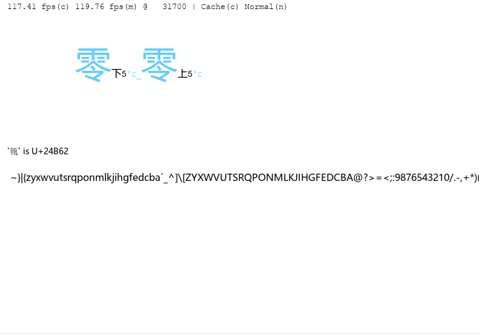

**2D Dynamic Texture Atlas Caching Algorithm**

---

## Overview

While algorithms like **Skyline** handle 2D packing (space management) and **S3-FIFO** handle cache eviction (time management), few solutions address both simultaneously. **Biped** fills this gap by managing tile placement, recycling, and eviction based on "hot/cold" access patterns within a 2D Atlas.

Inspired by the **Buddy algorithm**, Biped supports node splitting and merging for fast texture cache space management.

**Features:**
- Power-of-2 sized Atlas textures
- Size Class Level system for tile classification
- Efficient allocation and recycling via MAP/BASE/LEVEL structures

**Limitations:**
- Relatively lower space utilization compared to some packing algorithms

**Documentation:** [Algorithm Details (English)](algorithm.md) | [算法说明 (中文)](algorithm.zh-cn.md)




---

## Usage

Header-only library. Include `biped.h` in your project.

In **one** compilation unit, define `BIPED_C_IMPLEMENTATION` before including the header:

```c
#define BIPED_C_IMPLEMENTATION
#include "biped.h"
```

### Customizable Macros

Override these macros **before** including `biped.h` to customize memory allocation and hashing:

| Macro | Default | Description |
|-------|---------|-------------|
| `biped_malloc` | `malloc` | Memory allocation |
| `biped_free` | `free` | Memory deallocation |
| `biped_realloc` | `realloc` | Memory reallocation |
| `biped_hash` | `biped_hash_impl` | Hash function for keys |

Example:

```c
#define biped_malloc my_malloc
#define biped_free my_free
#define biped_realloc my_realloc
#define biped_hash my_hash_function

#define BIPED_C_IMPLEMENTATION
#include "biped.h"
```

---

## Use Cases

### Atlas Texture Management

- Uses **fixed power-of-2 sized** textures
- **Target scenario**: 2048×2048 RGBA Atlas storing text glyphs ranging from 8×16 to 64×64, with thousands of nodes
- RGB channels store MSDF or subpixel data; A channel stores grayscale
- Two Biped caches can jointly manage a single RGBA Atlas

---

## Performance

Test environment: MSVC, small object allocation with `free(malloc(211))`. Below are typical path timings and relative speeds.

| Scenario | Operation | TIME | SPEED |
|----------|-----------|------|-------|
| **1. Cache Hit** | lock_key + unlock | 0.8 | 1.2× |
| **2. Miss (A)** Direct cold node reuse | lock_key + lock_key_value + unlock | 1.23 | 0.8× |
| **3. Miss (B)** High-level split | lock_key_value + unlock | 1.9 | 0.52× |
| **4. Miss (Fail)** No reusable space | lock_key_value | 72 | 0.012× |

### Analysis

- Overall performance is comparable to malloc/free operations
- **No external fragmentation**
- Internal fragmentation depends on data (no fragmentation when using only 32/64 MSDF)
- **Cache Hit**: Only queries MAP and marks access — minimal overhead
- **Miss (A)**: Evicts and reuses same-level cold node — slightly slower than hit
- **Miss (B)**: Finds coldest node across levels and splits — involves LEVEL scanning and splitting
- **Miss (Fail)**: Attempts A/B/C paths before failing — significantly higher latency

---

## 概述

目前已有天际线(Skyline)等 2D pack 类算法负责**空间管理**, 也有 S3 FIFO 等负责**时间管理**(如缓存淘汰), 但少有同时兼顾空间与时间的方案. 这里即针对这一缺口:在 2D Atlas 上既做图块摆放与回收, 又按"冷热"做淘汰与复用.

本算法受 Buddy(伙伴)算法启发, 支持节点的分裂与合并, 用于快速管理纹理缓存空间.

**特点**: 基于 2 幂次尺寸的 Atlas 纹理, 通过 Size Class Level 将图块分级, 结合 MAP/BASE/LEVEL 等结构实现分配与回收.

**局限**: 空间利用率相对不高.

**文档:** [算法说明 (中文)](algorithm.zh-cn.md) | [Algorithm Details (English)](algorithm.md)

---

## 用法

Header-only 风格库. 在项目中包含 `biped.h` 即可.

在**一个**编译单元中, 在包含头文件前定义 `BIPED_C_IMPLEMENTATION`:

```c
#define BIPED_C_IMPLEMENTATION
#include "biped.h"
```

### 可覆盖的宏

在包含 `biped.h` **之前**定义以下宏以自定义内存分配和哈希函数:

| 宏 | 默认值 | 说明 |
|----|--------|------|
| `biped_malloc` | `malloc` | 内存分配 |
| `biped_free` | `free` | 内存释放 |
| `biped_realloc` | `realloc` | 内存重分配 |
| `biped_hash` | `biped_hash_impl` | 键的哈希函数 |

示例:

```c
#define biped_malloc my_malloc
#define biped_free my_free
#define biped_realloc my_realloc
#define biped_hash my_hash_function

#define BIPED_C_IMPLEMENTATION
#include "biped.h"
```

---

## 应用场景

### Atlas 纹理

- 使用**固定 2 幂次大小**的纹理.
- **预设场景**: 在 2048x2048, RGBA 的 Atlas 上, 存放 8x16 至 64x64 的文本, 节点数量为数千量级.
- RGB 通道存 Msdf 或次像素信息, A 通道存灰度信息; 因此设计上可用两个 Biped 缓存共同管理一个 RGBA Atlas.

---

## 性能测试

测试环境: MSVC, `free(malloc(211))` 小对象申请操作. 以下为典型路径的耗时与相对速度.

| 场景 | 调用 | TIME | SPEED |
|------|---------|------|-------|
| **1. Cache Hit** | lock_key + unlock | 0.8 | 1.2 |
| **2. Miss (A)** 直接复用冷节点 | lock_key + lock_key_value + unlock | 1.23 | 0.8 |
| **3. Miss (B)** 高 Level 分裂 | lock_key_value + unlock | 1.9 | 0.52 |
| **4. Miss (失败)** 无可复用空间 | lock_key_value | 72 | 0.012 |

- 总体来看: 可以视为malloc/free相同代价的操作. 
- 但是不存在外部碎片
- 内部碎片则视数据而定(只用32/64 Msdf将不会有碎片)
- **Cache Hit**: 仅查 MAP 并 MARK, 开销最小.
- **Miss (A)**: 同 Level 冷节点驱逐与复用, 略慢于 Hit.
- **Miss (B)**: 跨 Level 取最冷节点再分裂, 涉及 LEVEL 扫描与分裂.
- **Miss (失败)**: 需尝试 A/B/C 均失败后的路径, 耗时显著升高.
